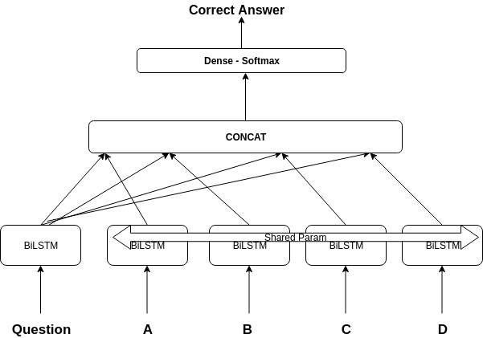

## Introduction

Bidirection Lstm Based Model. [[trained_model]](https://drive.google.com/file/d/1puO_gOkx17aU-hEExxzCLTCHGieEBP6c/view?usp=sharing) (Not trained properly, Very low accuracy)

## Requirement
- tensorflow==1.12.0
- nltk
- gensim
- pandas
- scikit-learn

## Getting Started 

1) Run EDA notebook
2) Training - Run Model notebook
3) Testing - Run Test notebook  (Change "checkpoint" to trained_model parent folder )
