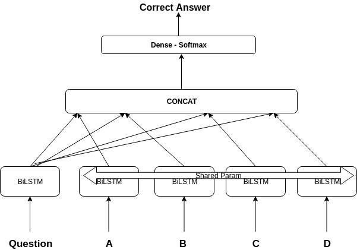

## Introduction

Bidirection Lstm Based Model. [[trained_model]]()

## Requirement
- tensorflow
- nltk
- pandas
- scikit-learn

## Getting Started 

1) Extract science_bot in root folder
2) Run EDA notebook
3) Training - Run Model notebook
4) Testing - Run Test notebook  (Change "checkpoint" to trained_model parent folder )